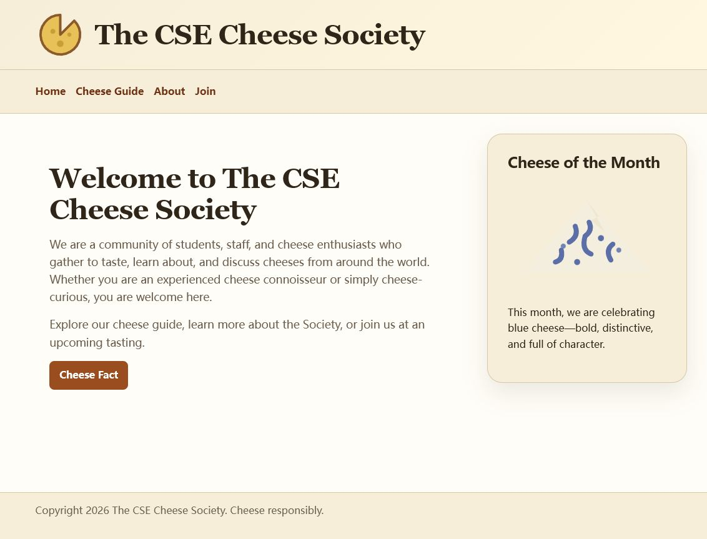

# The CSE Cheese Society

A responsive, multi-page website for a fictional campus cheese society. The project demonstrates semantic HTML, modular CSS, accessible navigation and forms, native browser UI elements, and deployment as a static site.

[View the live site](https://cse134b-hw4-zhibo.netlify.app/)



## Highlights

- Nine hand-authored HTML pages with consistent site navigation
- Responsive layouts for desktop and mobile viewports
- A four-category cheese guide with custom SVG illustrations
- Accessible landmarks, labels, alternative text, and keyboard focus states
- Native HTML popover, dialog, details, and form controls
- Custom design tokens and cascade layers for maintainable styling
- A dedicated 404 page and Netlify deployment

## Technical approach

The site is intentionally framework-free. Shared colors, spacing, typography, and borders live in `styles/tokens.css`; global element defaults and reusable site chrome are separated from page-specific layouts. CSS cascade layers keep reset, base, component, and layout rules predictable.

Each document uses semantic landmarks such as `header`, `nav`, `main`, `article`, `aside`, and `footer`. The content pages also use `figure`, `details`, `blockquote`, and correctly associated form labels to preserve meaning without JavaScript.

## Quality checks

The repository uses automated checks for:

- HTML validity and accessible document structure
- Broken relative links and missing local assets
- CSS syntax and common stylesheet errors

GitHub Actions runs the checks on every push and pull request.

## Run locally

The site has no build step. Start any static file server in the repository root, for example:

```bash
npx serve .
```

Then open the local address printed in the terminal.

To run the quality checks:

```bash
npm ci
npm test
```

## Project structure

```text
guide/          Cheese guide overview and family detail pages
images/         Original SVG illustrations and logo
styles/         Design tokens, global styles, and page layouts
docs/           Screenshots and design decisions
index.html      Home page
about.html      Society background and expandable profiles
join.html       Accessible membership form and native dialog
404.html        Custom not-found page
```

## Design decisions

The original implementation and lessons learned about repeated layouts, relative paths, and future componentization are documented in [Design Decisions](docs/design-decisions.md).

## Project context

This project began as an individual UC San Diego CSE 134B assignment and was subsequently refined as a portfolio-quality static website. All implementation and commits in this repository are my own.
